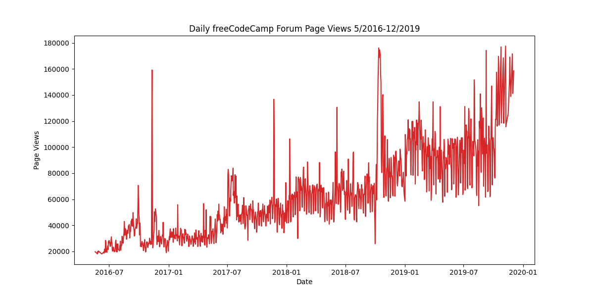
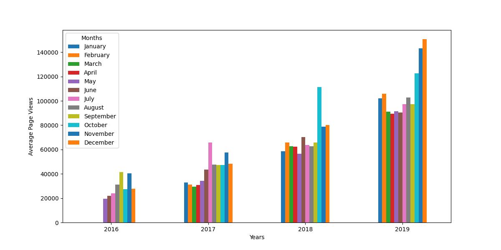
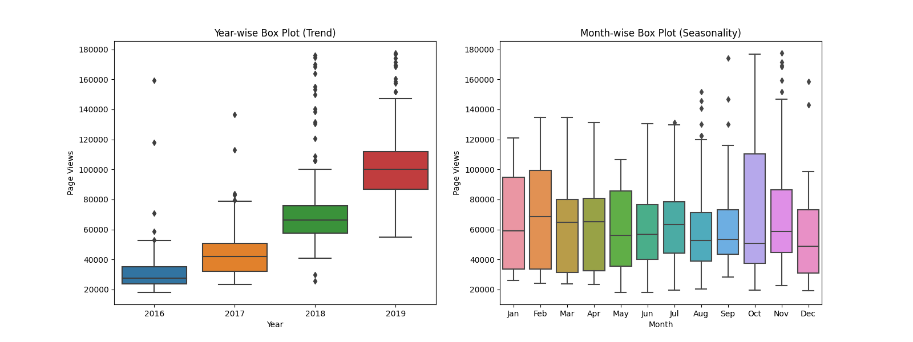

# Page View Time Series Visualizer

This repository contains a Python script for visualizing time series data of page views. The script generates a line plot, a bar plot, and a box plot to analyze the data.

## Table of Contents
- [Introduction](#introduction)
- [Features](#features)
- [Installation](#installation)
- [Usage](#usage)
- [Output](#output)
- [Contributing](#contributing)

## Introduction

The **Page View Time Series Visualizer** project uses a dataset containing page view data to compute and visualize various statistics. This tool is useful for understanding the trends and patterns in page views over time.

## Features

- Cleans the data by filtering out days with page views in the top 2.5% or bottom 2.5%.
- Generates a line plot to show daily page views.
- Creates a bar plot to show average monthly page views for each year.
- Draws box plots to show the distribution of page views by year and by month.

## Installation

To use this project, you need to have Python, Pandas, Seaborn, and Matplotlib installed on your system. You can install the required packages using pip:

\`\`\`bash
pip install pandas seaborn matplotlib
\`\`\`

## Usage

1. Clone this repository to your local machine.
2. Ensure that you have the required dependencies installed.
3. Place the dataset file (\`fcc-forum-pageviews.csv\`) in the same directory as the script.
4. Run the script to generate and save the visualizations.

## Output

The script will output the following visualizations:

- Line Plot:
  

- Bar Plot:
  

- Box Plot:
  

## Contributing

Contributions are welcome! Please feel free to submit a Pull Request.

